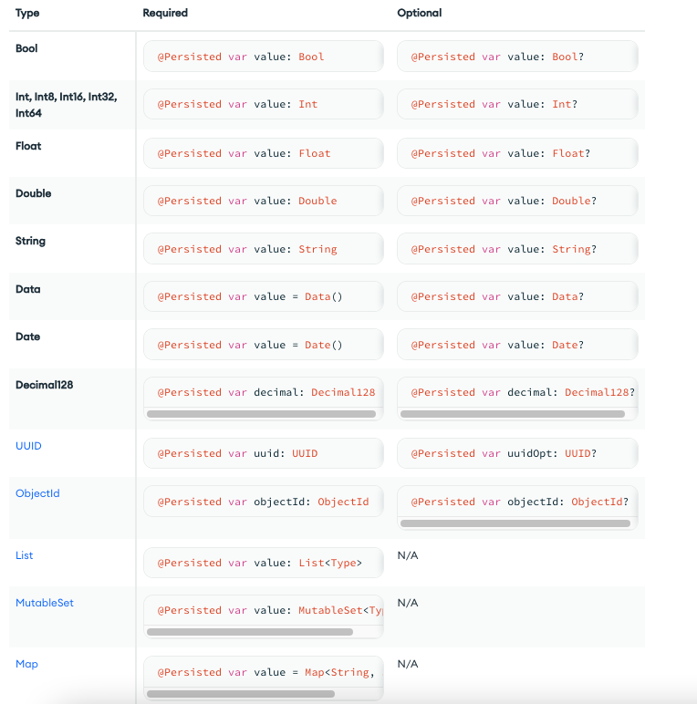
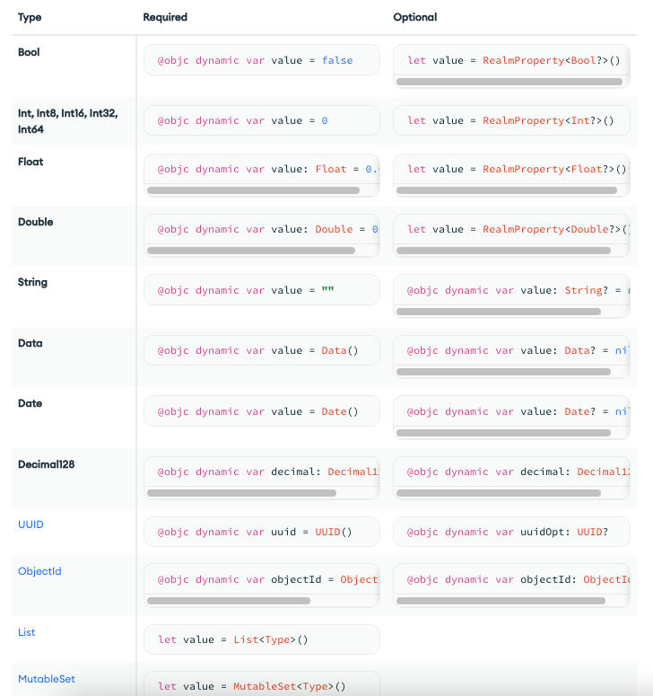
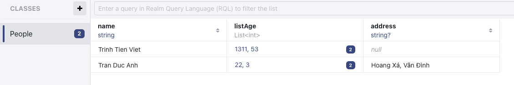
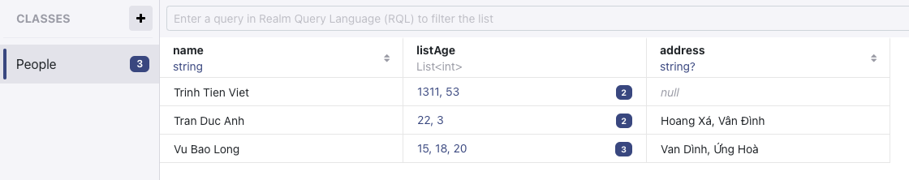
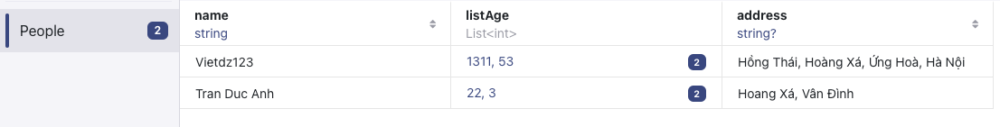

# Learning-Realm

Install Realm
```php
pod 'RealmSwift', '~>10'
```

Find Fild Realm
```php
print("DEBUG: \(FileManager.default.urls(for: .documentDirectory, in: .userDomainMask).first)
```

## I. QuickStart

Near the top of any Swift file that uses Realm, add the following import statement:
```php
import RealmSwift
```

## 1.0 Kiểu dữ liệu List trong Realm
Trước đây, `List` class chỉ có thể store colleciton of realm object. Nhưng các phiên bảo sau này, `List` có thể chứa object, value types, optionals,... 


## 1.1 Model Data Swfit
- Object Types & Schema:
Một Readlm Model như là 1 đối tượng chứa ra nhiều field-value, các kiểu dữ liệu được support trong Realm sẽ được viết ở mục **1.3**

**Readlm Objects chỉ đơn giản là các Classes trong Swfit hoặc Objective-C**, nhưng Readlm cũng cấp thêm các feature như [live queries](https://www.mongodb.com/docs/realm/sdk/swift/realm-database/#std-label-ios-live-queries). The Swift SDK memory maps Realm objects directly to native Swift or Objective-C objects, which means there's no need to use a special data access library, such as an ORM. Instead, **you can work with Realm objects as you would any other class instance**.

Mọi Readlm Object cần comform **Object** type. Một Readlm Object là 1 class mà defint các properties và [relationships](https://www.mongodb.com/docs/realm/sdk/swift/model-data/#std-label-ios-client-relationships). Realm handles relationships thông qua việc sử dụng **reference properties** tới các Readlm Object khác. Vì vậy ta sẽ read hoặc write tới các properties này 1 cách trực tiếp. Realm hỗ trợ to-one, to-many, and inverse relationships.

- To-One RelationShip: Có nghĩa là 1 Object chỉ relates tới 1 Object khác
  
```php
class Person: Object {
    @Persisted var name: String = ""
    @Persisted var birthdate: Date = Date(timeIntervalSince1970: 1)
    // A person can have one dog
    @Persisted var dog: Dog?
}
class Dog: Object {
    @Persisted var name: String = ""
    @Persisted var age: Int = 0
    @Persisted var breed: String?
    // No backlink to person -- one-directional relationship
}
```

- To-Many relationShip: Có nghĩa là 1 đối tượng sẽ relate tới nhiều hơn 1 đối tượng khác.
  
```php
class Person: Object {
    @Persisted var name: String = ""
    @Persisted var birthdate: Date = Date(timeIntervalSince1970: 1)
    // A person can have many dogs
    @Persisted var dogs: List<Dog>
}
class Dog: Object {
    @Persisted var name: String = ""
    @Persisted var age: Int = 0
    @Persisted var breed: String?
    // No backlink to person -- one-directional relationship
}
```

- Inverse RelationShip: Ta nên biết rằng Relationship trong Realm là 1 chiều. Để 1 đối tượng khác link back tới đối tượng khác, ta phải explicit và sử dụng [LinkObject](https://www.mongodb.com/docs/realm-sdks/swift/latest/Structs/LinkingObjects.html).

```php
class User: Object {
    @Persisted(primaryKey: true) var _id: ObjectId
    @Persisted var _partition: String = ""
    @Persisted var name: String = ""
    // A user can have many tasks.
    @Persisted var tasks: List<Task>
}
class Task: Object {
    @Persisted(primaryKey: true) var _id: ObjectId
    @Persisted var _partition: String = ""
    @Persisted var text: String = ""
    // Backlink to the user. This is automatically updated whenever
    // this task is added to or removed from a user's task list.
    @Persisted(originProperty: "tasks") var assignee: LinkingObjects<User>
}
```

Bên cạnh đó, mọi Readlm Object là **live object,** điều này có nghĩa là nó sẽ tự động được update mỗi khi được thay đổi. Realm có thể phát ra một [notification event](https://www.mongodb.com/docs/realm/sdk/swift/react-to-changes/#std-label-ios-react-to-changes) bất cứ khi nào propertu bị thay đổi.

- Model Inheritance

Ta có thể subclass Realm Model để share behavior giữa những classes. Nhưng vẫn có 1 vài hạn chế mà **Realm không cho phép** như sau:
- Cast between polymorphic classes: subclass to subclass, subclass to parent, parent to subclass
- Query on multiple classes simultaneously: for example, "get all instances of parent class and subclass"
- Multi-class containers: List and Results with a mixture of parent and subclass

Chú ý: Từ version 10.10.0, chúng ta không thể mix `@Persisted` và `@objc dynamic` property trong cùng 1 class(Cái này không phải là trường hợp trùng tên nhé, mà là ko được phép tồn tại `@Persisted` và `@objc dynamic` trong cùng 1 class). Nếu cố tình khai báo cả 2, tất cả các `@objc dynamic property` sẽ bị ignore, dẫn đến dead app. Tuy nhiên, ta có thể mix 2 kiểu này giữa base class và subclass. For example, a base class could have a @Persisted var foo: Int property, and a subclass could have an @objc dynamic var bar = 0 property.

- Propeties:
Như đã nói, Realm Object Model là 1 collection của các properties. Khi khai báo model, chúng ta phải khai báo các propertíe, chúng ta cần **give Realm information about each property.**
-   Kiểu dữ liệu property, property đó là optional hay required
-   Liệu rằng Realm nên sotre hay ignore property.
-   Liệu rằng property đó là primary key hay không.

## 1.2 Define a Realm Object Model
Khi ta define 1 Class, tên của class sẽ là tên của table trong Realm, và tên của propeties là tên của các column trong table.

- Declare Propeties
Khi ta khai báo 1 properties, ta có thể chỉ định rằng thuộc tính đó có được quản lý bởi Realm hay không. **Managed Properties** sẽ được lưu và update trong database. **Ignored propeties** sẽ không được lưu trong db. Chúng ta có thể mix managed and ignored properties trong cùng 1 class.

- Persisted Propeties Attributes:
Yuwf phiên bản 10.10.0: `@Persisted` được sử dụng để thay thế cho `@obj dynamic`, `RealmOptional` và `RealmPropety`. Khai báo propeties với từ khóa `@Persisted` khi ta muốn propeties đó được lưu vào trong database. Khi ta khai báo bất kì propeties nào với từ khoá `@Persisted` thì  các properties khác mà ko phải là `@Persisted` sẽ bị ignored.

- Objective-C Dynamic Property Attributes:
Với các version trước 10.10.0, ta có thể khai báo 1 biến với `@obj dynamic`. Ta có thể sử dụng 2 cách sau:
- Sử dụng `@obj dynamic` khi khai báo từng biến properties
- Sử dụng `@objcMembers` để khai báo class, sau đó khai báo các properties đó với `dynamic var.`
- Use let to declare LinkingObjects, List, RealmOptional and RealmProperty

```php
@objcMembers class MusicModel: Object {
    dynamic var id: String = UUID().uuidString
    dynamic var name: String = ""
    dynamic var duration: Double = 0
    dynamic var artist: String = ""
}

class Project: Object {
    @objc dynamic var id = 0
    @objc dynamic var name = ""
}
```

- Specify a Primary Key
Chúng ta có thể chỉ định 1 property là **primary key** cho class. Primary key cho phép ta find, update, insert object 1 cách hiệu quả. Primary Key cũng có 1 vài limitations sau:
-   Chỉ được define 1 primary key trên 1 model
-   Primary key values phải là độc nhất trong tất cả các instance object của Realm. Nếu Primary Key nào có values bằng nhau, Realm sẽ throws an error.
-   Primary key values phải là immutable. Để thay đổi primary key value, ta phải xoá luôn object đó đi, và insert 1 object với primary key value mứoi.
-   [Embedded object](https://www.mongodb.com/docs/realm/sdk/swift/model-data/relationships/#std-label-ios-embedded-objects) ko thể defint 1 primary key.

Với after 10.10.0:

```php
class Project: Object {
    @Persisted(primaryKey: true) var id = 0
    @Persisted var name = ""
}
```

Với before 10.10.0:

```php
class Project: Object {
    @objc dynamic var id = 0
    @objc dynamic var name = ""
    // Return the name of the primary key property
    override static func primaryKey() -> String? {
        return "id"
    }
}
```

- Index a Propety: Chưa đọc, kiểu nó tạo subscript ý.

- ignore Property:
Ignored properties behave exactly like normal properties. They can't be used in queries and won't trigger Realm notifications. f you don't want to save a field in your model to its realm, leave the @Persisted notation off the property attribute.

Additionally, if you mix @Persisted and @objc dynamic property declarations within a class, the @objc dynamic properties will be ignored.

- Declare Enum Properties
Changed in version 10.10.0: Protocol is now `PersistableEnum` rather than `RealmEnum`. Trước version đó, Realm chỉ support Int và @objc enum

```php
// Define the enum with ver after 1.10
enum TaskStatusEnum: String, PersistableEnum {
    case notStarted
    case inProgress
    case complete
}
// To use the enum:
class Task: Object {
    @Persisted var name: String = ""
    @Persisted var owner: String?
    // Required enum property
    @Persisted var status = TaskStatusEnum.notStarted 
    // Optional enum property
    @Persisted var optionalTaskStatusEnumProperty: TaskStatusEnum? 
}
```

```php
// Define the enum with ver 10.10
@objc enum TaskStatusEnum: Int, RealmEnum {
    case notStarted = 1
    case inProgress = 2
    case complete = 3
}
// To use the enum:
class Task: Object {
    @objc dynamic var name: String = ""
    @objc dynamic var owner: String?
    // Required enum property
    @objc dynamic var status = TaskStatusEnum.notStarted 
    // Optional enum property
    let optionalTaskStatusEnumProperty = RealmProperty<TaskStatusEnum?>() 
}
```

## 1.3 Supported Types
Khi ta tạo 1 group of object Realm, group đó được gọi là 1 **collection.** Collection là 1 đối tượng chứa 0 hoặc 1, hoặc nhiều instance của Realm Object. *Realm collections are homogenous: all objects in a collection are of the same type.*

Chúng ta có thể filter, sort collection bằng cách sử dung Realm'[query engine](https://www.mongodb.com/docs/realm/sdk/swift/crud/filter-data/#std-label-ios-client-query-engine).

Các kiểu dữ liệu được support trong Realm 

- Sau ver 10.10



- Trước ver 10.10



- Size Limitations:

Data and string properties cannot hold more than 16MB. Realm throws a runtime exception if your app attempts to store more than 16MB in a single property. To avoid size limitations and a performance impact, it is best not to store large blobs, such as image and video files, directly in a realm. Instead, save the file to a file store and keep only the location of the file and any relevant metadata in the realm.

- Map/Dicinary
The Map is an associative array that contains key-value pairs with unique keys.

Like Swift's Dictionary, Map is a generic type that is parameterized on its key and value types. Unlike native Swift collections, Realm Maps are reference types (classes), as opposed to value types (structs).

```php
class Dog: Object {
    @Persisted var name = ""
    @Persisted var currentCity = ""
    // Map of city name -> favorite park in that city
    @Persisted var favoriteParksByCity: Map<String, String>
}
```

- AnyRealmValue:

AnyRealmValue is a Realm property type that can hold different data types. Supported AnyRealmValue data types include: Int, Float, Double, Decimal128, ObjectID, UUID, Bool, Date, Data, String, Object

```php
class Dog: Object {
    @Persisted var name = ""
    @Persisted var currentCity = ""
    @Persisted var companion: AnyRealmValue
}
```

## 1.4 Change an Object Model

- What is Schema?

The following schema defines a Dog object type with a string name, optional string breed, date of birth, and primary key ID.
```php
class Dog: Object {
    @Persisted(primaryKey: true) var _id: ObjectId
    @Persisted var name = ""
    @Persisted var breed: String?
    @Persisted var dateOfBirth = Date()
}
```

Mỗi khi chúng ta cần update 1 schema như add thêm properties, remove properties,..  Realm có thể thực hiện migration automatically. Chúng ta chỉ cần increment the `schemaVersion.`

- Automatically Update Schema
1. Add hoặc Delete a Property

Realm can automatically migrate added properties, but you must specify an updated schema version when you make these changes.  For new optional properties, existing records can have null values. This means you don't need a migration block when adding optional properties.

Chưa update:

```php
class Person: Object {
    @Persisted var firstName = ""
    @Persisted var lastName = ""
    @Persisted var age = 0
}
```

Sau đó The developer decides that the Person class needs an email field and updates the schema.
```php
class Person: Object {
    @Persisted var firstName = ""
    @Persisted var lastName = ""
    // Add a new "email" property.
    @Persisted var email: String?
    // New properties can be migrated
    // automatically, but must update the schema version.
    @Persisted var age = 0
}
```

Realm sẽ tự động migrates the realm để comform vào sự update đó. Nhưng chúng cần set realm's schema version bằng 2:

```php
let config = Realm.Configuration(
    schemaVersion: 2)
// Use this configuration when opening realms
Realm.Configuration.defaultConfiguration = config
let realm = try! Realm()
```

Còn vài trường hợp nữa, vui long đọc thêm [Migration](https://www.mongodb.com/docs/realm/sdk/swift/model-data/change-an-object-model/).

# II. CRUD

- Write Transactions:

Mỗi khi chúng ta **create** object trong realm, **update** hoặc thậm chí là **delete** object đó, thì tất cả các hành động động đó đều modify state of realm, vì vậy họ gọi đó là **writes transactions.**

Một transaction là 1 list các hành động read hoặc write. Điều đó có nghĩa là "a transaction is all or nothing", trong một transaction, nếu có bất kì hành động nào failed thì sẽ gọi là failed, không thì tất cả các hành động phải cùng succeed, lúc đó gọi là transaction succeed.

Mọi hành động write phải được thực thi trong 1 transaction.

***Realm chỉ cho phép 1 transaction thực thi tại 1 thời điểm.*** Realms sẽ block hành động write khác trên Thread khác cho đến khi hành động write hiện tại thực thi xong. Vì vậy, sẽ không xảy ra hiện tượng race condition giữa các transaction.

When you are done with your transaction, Realm either commits it or cancels it:

- When Realm commits a transaction, Realm writes all changes to disk. For synced realms, the SDK queues the change for synchronization with Atlas Device Sync.

- When Realm cancels a write transaction or an operation in the transaction causes an error, all changes are discarded (or "rolled back").

## 2.1 Create an Object and write 

Tạo class Object:

```php
class People: Object {
    @Persisted var name: String
    @Persisted var listAge: List<Int> = List<Int>()
    @Persisted var address: String?
}
```

Tạo instance và write:

```php
let viet = People()
viet.name = "Trinh Tien Viet"
viet.listAge.append(1311)
viet.listAge.append(53)

let ducanh = People()
ducanh.name = "Tran Duc Anh"
ducanh.listAge.append(22)
ducanh.listAge.append(03)
ducanh.address = "Hoang Xá, Vân Đình"

let config = Realm.Configuration(
    schemaVersion: 2)
Realm.Configuration.defaultConfiguration = config
let realm = try! Realm()

try! realm.write {
    realm.add(viet)
    realm.add(ducanh)
}
```

Để có thể tìm đường dẫn đến file Realm: 

```php
print("DEBUG: \(FileManager.default.urls(for: .documentDirectory, in: .userDomainMask).first)
```

Sau khi write xong, ta mởi file Realm lên và thu được kết quả như sau:



Ta chú ý có đoạn code:

```php
let config = Realm.Configuration(
    schemaVersion: 2)
Realm.Configuration.defaultConfiguration = config
let realm = try! Realm()
```

Lý do có đoạn code này bởi vì, lúc đầu Class People chỉ có Properties, sau đó ta thực hiện action Write. Một lúc sau, ta lại muốn thêm 1 properties address, thì lúc này ta phải thực hiện quá trình migration như phần 1.4.

- Initialize Objects with a Value:
  
Chúng ta có thể khởi tạo Object thông qua sử dụng hàm `Object.init(value:)`.

```php
func initObject() {
    let baolong = People(value: ["Vu Bao Long", [15, 18, 20], "Van Dình, Ứng Hoà"])
    
    let config = Realm.Configuration(
        schemaVersion: 2)
    Realm.Configuration.defaultConfiguration = config
    let realm = try! Realm()
    
    
    try! realm.write {
        realm.add(baolong)
    }
    }
```

Output:



Chú ý: Ta vẫn thấy cần migration, hmm ko hiểu lắm.

## 2.2 Read from Realm

A read from a realm generally consists of the following steps:
- Get all **objects** of a certain type from the realm
- Optionally, **filter** the results.
- Optionally, sort the results.

- Results Are Not Copie:
Kết quả từ việc read Data từ Realm không phải là bản copy. Mỗi khi modify result sẽ thay đổi dữ liệu trên disk trực tiếp. Đây gọi là memory mapping(Realm by passes all of this using zero-copy live objects. Realm object accessors point directly into database storage using memory mapping, so there is no distinction between the objects in Realm and the results of your query in application memory.)

- Query all Object of a Given Type

```php
func readAll() {
    let realm = try! Realm()
    
    let allPeople = realm.objects(People.self)
    print("DEBUG: \(allPeople)")
}
```

Output:


- Filter Queries Based on Object Properties

```php
func filterQuery() {
    let realm = try! Realm()
    
    let allPeople = realm.objects(People.self)
    
    let viet = allPeople.first {
        return $0.name == "Trinh Tien Viet"
    }
    print("DEBUG: \(viet)")
}
```

## 2.3 Update Realm Objects

```php
func updateData() {
    let realm = try! Realm()
    
    let viet = realm.objects(People.self).first!
    
    try! realm.write {
        viet.name = "Vietdz123"
        viet.address = "Hồng Thái, Hoàng Xá, Ứng Hoà, Hà Nội"
    }
}
```

Output:


## 2.4 Delete Realm Objects

```php
func deleteData() {
    let realm = try! Realm()
    
    let long = realm.objects(People.self).last!
    
    try! realm.write({
        realm.delete(long)
    })
    
}
```

Output:



- Delete an Object and Its Related Objects:
Sometimes, you want to delete related objects when you delete the parent object. We call this a chaining delete. Realm does not delete the related objects for you. If you do not delete the objects yourself, they remain orphaned in your realm. Whether or not this is a problem depends on your application's needs.

The best way to delete dependent objects is to iterate through the dependencies and delete them before deleting the parent object.
  
- Delete All Objects of a Specific Type:

```php
let realm = try! Realm()
try! realm.write {
    // Delete all instances of Dog from the realm.
    let allDogs = realm.objects(Dog.self)
    realm.delete(allDogs)
}
```
- Delete All Objects in a Realm:
  
```php
let realm = try! Realm()
try! realm.write {
    // Delete all objects from the realm.
    realm.deleteAll()
}
```